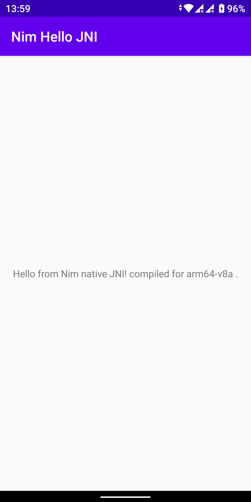

Nim Hello JNI
=============
Nim Hello JNI is an Android sample that uses JNI to call C code from a Android Java Activity, with the C code generated from the Nim computer language instead of directly from C source files.

This has been adapted from [sample hello-jni android project](https://github.com/android/ndk-samples/tree/master/hello-jni)

The changes have been to add the required .nim files, adding nim biuld script files (.cmd for windows and sh for linux), changing to using ndk-build instead of CMake, and adding an Android.mk file to do the native code building.

Notable discoveries were that the nimbase.h file needs to be made available for the native build process to work and that NimMain needs to be called before anything can be done with Nim strings as the Android and Nim Garbage Collection (GC) and memory management systems otherwise conflict (unless some alternate GC is used, but the best of those are still in development and not really recommended; using --gc:none will cause memory leaks if used extensively without a great deal of extra complexity in creating cstring's); these issues are documented various places in the Nim documentation and in the Nim forum, but this is the only place that everything is brought together.  As well, since the Nim produced .c files are hard coded for cpu architecture, we use separate directories for each cpu and make the build system select the correct one depending on the currently building architecture.  Further, the slickest way to run the NimMain `proc` is to run it in a JNI_OnLoad routine so it will automatically be run just once when the dynamic library file is loaded.

The build system used here where Nim is used to (`-c`) compile to .c files only and letting the build system turn those files into shared library files seems slightly simpler than using Nim to compile all the way to shared dynamic libraries to be just included by the build system as third party libraries, although doing that would also work and would eliminate the need for the `nimbase.h` file in the build files system.

Pre-requisites
--------------
- Android Studio 2.2+ with [NDK](https://developer.android.com/ndk/) bundle.

Getting Started
---------------
1. [Install Nim](https://nim-lang.org/install.html) for your platform.
1. [Download Android Studio](https://developer.android.com/sdk/index.html)
1. Install Android Studio as per the instructions.
1. Launch Android Studio.
1. Open *Tools/SDK Manager* and be sure the Android 10.0 (Q) SDK Platform, 29.0.2 SDK Build tools and NDK (Side by side) are installed.
1. Download this repository as a .zip file and extract it to a location of your choice.
1. Open that project location with Android Studio to open the project.
1. From the Android Studio terminal run "buildnim.cmd" (for Windows) or "buildnim.sh" (for Linux/OSX) to compile the Nim files to .c files.
1. Click *Tools/Android/Sync Project with Gradle Files*.
1. Click *Run/Run 'app'*.
1. Alternatively, you can use "Build/Generate Signed Bundle/APK..." to generate an APK file that can be transfered to an Android phone and "side-loaded".
1. The above involves generating a signing store and key (one time), which can be done almost automatically with Android Studio.
1. You could store the signing store key file in this directory.

There is a prebuilt signed (with a generated signing key not provided) APK installation file available in the `app/release` directory that can by installed (side-loaded) on Android smartphones if one trusts that it's contents reflect the source provided here; if one doesn't trust it, generate a new one as described by the alternate process described above.

Screenshots
-----------

License
-------
Copyright (C) 2020 W. Gordon Goodsman (GordonBGood). All rights reserved.

Permission is hereby granted, free of charge, to any person obtaining a copy
of this software and associated documentation files (the "Software"), to deal
in the Software without restriction, including without limitation the rights
to use, copy, modify, merge, publish, distribute, sublicense, and/or sell
copies of the Software, and to permit persons to whom the Software is
furnished to do so, subject to the following conditions:

The above copyright notice and this permission notice shall be included in
all copies or substantial portions of the Software.

THE SOFTWARE IS PROVIDED "AS IS", WITHOUT WARRANTY OF ANY KIND, EXPRESS OR
IMPLIED, INCLUDING BUT NOT LIMITED TO THE WARRANTIES OF MERCHANTABILITY,
FITNESS FOR A PARTICULAR PURPOSE AND NONINFRINGEMENT. IN NO EVENT SHALL THE
AUTHORS OR COPYRIGHT HOLDERS BE LIABLE FOR ANY CLAIM, DAMAGES OR OTHER
LIABILITY, WHETHER IN AN ACTION OF CONTRACT, TORT OR OTHERWISE, ARISING FROM,
OUT OF OR IN CONNECTION WITH THE SOFTWARE OR THE USE OR OTHER DEALINGS IN
THE SOFTWARE.

[ MIT license: http://www.opensource.org/licenses/mit-license.php ]
